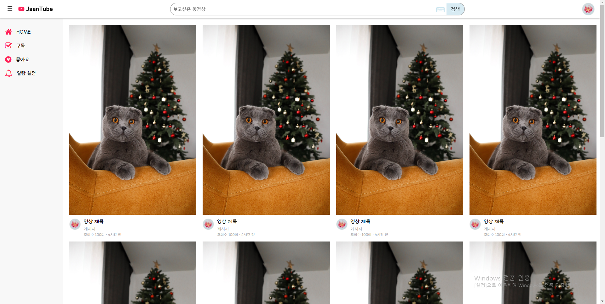
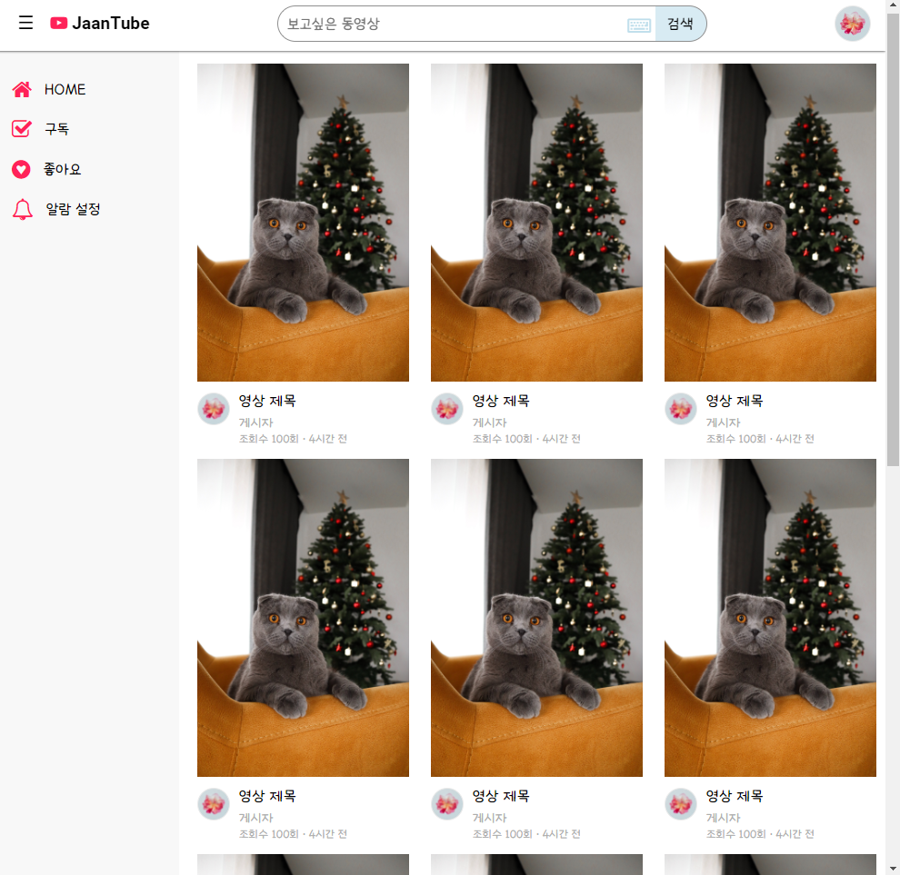

# 📽 JaanTube
Youtube 컨셉의 반응형 웹사이트 
https://jaaninson.github.io/JaanTube/

---
## 화면 크기에 따라 변경되는 UI 구현
### 📌 BreakPoint 1000px / 800px / 400px 

 

- 기본 화면(1000px 이상)
  - 썸네일 4장 가로배치 
  - 좌측 네비게이션
  - 헤더 로고, 검색창, 프로필 

 

- 801px ~ 1000px
  - 썸네일 3장 가로배치 
  - 헤더, 네비게이션 유지

 

- 401px ~ 800px
  - 썸네일 2장 가로배치 
  - 네비게이션 축소
  - 헤더 로고 감추기

 
- 400px 이하
  - 썸네일 1장
  - 검색창 돋보기 ntt 로 대체
  - 네비게이션 감추기

## 정리
반응형 웹 구조의 분기점에 대해 이해하고, 각 단위에 대한 학습을 통해 기기별 다양한 크기의 화면에 대응할 수 있는 반응형 웹 사이트 제작기술을 습득함.
- html ntt code 에 대한 이해
- max-width 와 min-width 를 활용한 분기점 설정
- 반응형 단위 em, rem, vw, vh, vmin, vmax 
